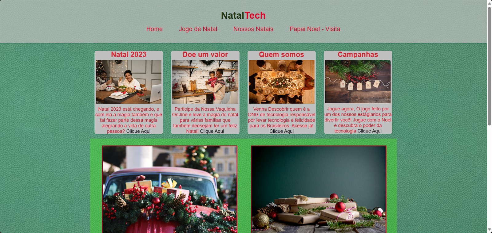
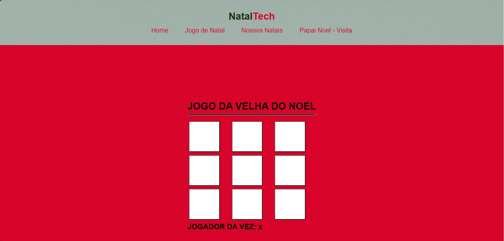

# Site da Campanha de Natal 2023

Site de Natal 

Conforme solicitado, segue o projeto de Natal finalizado, Não consegui entregar o projeto que me pediram em um primeiro momento pois realemnte sei o básico da programação, e estou disposto a aprender mais caso me deêm essa oportunidade
com todo o conhecimento que adquirir até agora foi esse projeto que consegui fazer com 2 paginas, "Home" e "jogo de natal" utilizei um HTML CSS e JavaScript que até o momento é o que aprendi. 
Agradeço desde já!
